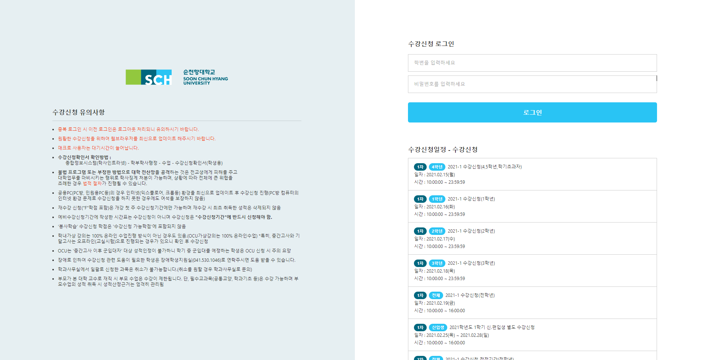
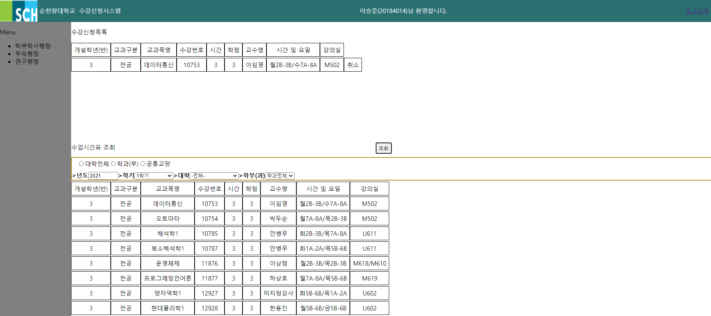
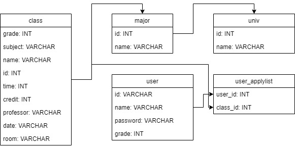

# Sugang
Sugang 은 순천향대 수강신청 사이트를 토대로 만든 수강신청 사이트입니다.
### 제작
* 박성진
    * Front: 메인 페이지(전체 레이아웃, 신청, 취소, 조회)
    * Back: 로그인, API(조회), DB(user_applylist 테이블 생성 및 데이터 삽입)
* 이승준
    * Front: 로그인 페이지, 메인 페이지(조회)
    * Back: API(조회, 신청, 취소), DB(class, major, univ, user 테이블 생성)

 

 

 

## 기능
* 로그인
* 과목 조건부 조회
* 학생 신청 과목 조회
* 수강 신청
* 수강 신청 취소

## 사용한 모듈
* mysql
* express
* express-session
* body-parser
* jade
* dialog

## DB

